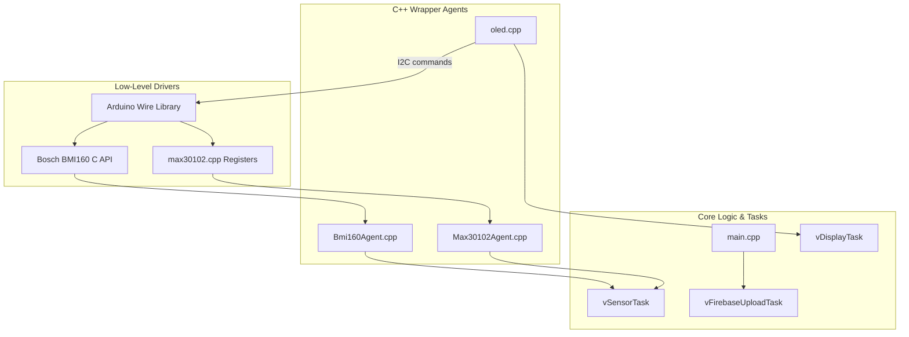

# Functional Specification Document (FSD)
## GuardPulse Smartband System
---

## 1. Document Information

| Field | Details |
| :--- | :--- |
| **Version** | 3.1 (Actual Codebase Revision) |
| **Status** | Approved / Synchronized with Firmware v2 |
| **Target MCU** | ESP32-C3 SuperMini (160 MHz 32-bit single-core RISC-V, 400 KB SRAM, 4 MB Flash) |
| **IMU Module** | BMI160 6-axis Accelerometer & Gyroscope (via Bosch Sensortec C API) |
| **Oximeter Module**| MAX30102 PPG Optical Heart Rate & SpO2 Sensor |
| **Display Module** | SSD1306 0.96" 128x64 px Monochrome OLED (I2C) |
| **Cloud Service** | Firebase Realtime Database (using Anonymous Sign-In) |
| **Topology** | Shared single I2C Bus (SDA: GPIO 8, SCL: GPIO 9 @ 400 kHz) |

---

## 2. Overview

### 2.1 Purpose
The GuardPulse Smartband is a wearable health-monitoring and emergency safety device designed primarily for elderly care. The system monitors vital signs—specifically heart rate (BPM) and blood oxygen saturation (SpO2)—and detects accidental falls. Telemetry is transmitted in real time to the cloud, allowing caregivers to monitor the user's status and dismiss false alarms or send drug reminders through a companion Flutter mobile application.

### 2.2 System Context
The GuardPulse system operates as a distributed IoT network comprising:
1. **The Smartband Hardware**: Collects raw PPG and inertial data, processes vital signs and fall triggers, and controls the local OLED interface.
2. **Firebase Realtime Database**: Acts as the central telemetry and command routing broker.
3. **The Flutter Mobile Application (FINALMADE)**: Subscribes to real-time database paths to show vitals, logs historical events, and transmits control commands back to the watch.

---

<pre>
                              GuardPulse Smartband
+---------------------------------------------------------------------------------------------+
|                                                                                             |
|  +-------------------+  +-----------------+  +------------------+  +------------------+   |
|  |Sensor Task - 100Hz|  |Display Task - 2Hz|  |Firebase Task-1.5s|  | Arduino loop - 1s|   |
|  +-------------------+  +-----------------+  +------------------+  +------------------+   |
|           |                  |       |              |       |                |              |
|       dataMutex           Reads  i2cMutex         Reads  i2cMutex        i2cMutex         |
|           |                  |       |              |       |                |              |
|           |                  |       v              |       v                v              |
|           |                  |  +-----------+       |  +----------+  +----------------+   |
|           |                  |  | SSD1306   |       |  | MAX30102 |  | I2C Self-      |   |
|           |                  |  | OLED Disp.|       |  | / BMI160 |  | Healing Check  |   |
|           +------------------+  +-----------+       |  +----------+  +----------------+   |
|                              |                      |                                       |
|                              +----------------------+                                       |
|                                          |                                                  |
|                                          v                                                  |
|                                +--------------------+                                      |
|                                |  sharedData Struct |                                      |
|                                +--------------------+                                      |
|                                                                                             |
+---------------------------------------------------------------------------------------------+
          |                          |                          |
  [Uploads Telemetry]         [Polls Commands]         [checkDeviceStatus]
          |                          |                          |
          v                          v                          v
+---------------------------------------------------------------------------------------------+
|                             Firebase Realtime Database                                      |
|                                                                                             |
|  +----------------------------------------------------------+                               |
|  | /users/{ownerUID}/devices_data/{deviceUID}/sensor_data  |                               |
|  +----------------------------------------------------------+                               |
|                                                                                             |
|  +-----------------------------------------------------------+                              |
|  | /users/{ownerUID}/devices_data/{deviceUID}/watch_commands |                             |
|  +-----------------------------------------------------------+                              |
|                                                                                             |
|  +----------------------------------------------------------+                               |
|  | /devices/{deviceUID}                                     |                               |
|  +----------------------------------------------------------+                               |
|                                                                                             |
+----^------------------------^------------------------------^--------------------------------+
    |                        |                              |
[Read Telemetry]  [Dismiss Alert / Sync Reminders]  [Pair Device via Code]
    |                        |                              |
+---------------------------------------------------------------------------------------------+
|                          Flutter Mobile App - FINALMADE                                     |
|                                                                                             |
|                           +----------------------+                                          |
|                           |    App UI Screen     |                                          |
|                           +----------------------+                                          |
|                                                                                             |
+---------------------------------------------------------------------------------------------+
</pre>

---
### 2.3 System Goals
* **High Core Loop Responsiveness**: Execute high-frequency sensor readings at 100Hz without latency penalty from cloud or display operations.
* **Low-Latency Fall Detection**: Detect falls and register alerts within 6 seconds.
* **Low Battery Draw**: Run the IMU in low-power accelerometer-only mode, waking up the power-hungry gyroscope only when an impact is suspected.
* **Self-Healing Connectivity & Bus**: Recover from Wi-Fi disconnects or I2C bus lockups automatically without requiring a manual hardware reboot.
* **Seamless Device Pairing**: Establish pairing using short 6-character unique pairing codes.

---

## 3. Hardware Requirements

### 3.1 Target Platform: ESP32-C3 SuperMini
The ESP32-C3 is a single-core RISC-V microcontroller. Because it lacks a secondary core, FreeRTOS tasks must be scheduled efficiently using cooperative or preemptive prioritization on Core 0.
* **RF Power Mitigation**: The Wi-Fi transmitter output power is limited to 10 dBm (`(wifi_power_t)40` in code) to stabilize communication, conserve battery, and minimize electromagnetic interference with the high-impedance I2C lines.

### 3.2 I2C Topology
The device relies on a single shared I2C bus:
* **Bus Pins**: SDA is assigned to **GPIO 8**, and SCL is assigned to **GPIO 9**.
* **Pull-Up Resistors**: The hardware relies on weak internal MCU pull-up resistors (~45 kΩ). No external hardware pull-ups are present.
* **Bus Speed**: Configured to **400 kHz** (Fast Mode) with a hardware timeout threshold of 50ms to prevent infinite blocking during electrical glitch states.
* **Addresses**:
  * MAX30102 Oximeter: `0x57` (fixed address)
  * BMI160 IMU: `0x68` (default, SDO pulled LOW) or `0x69` (fallback, SDO pulled HIGH)
  * SSD1306 OLED: `0x3C` (fixed address)

```
                       ESP32-C3 SuperMini
                       +----------------+
                       |   GPIO 8 (SDA) |---+-----------+-----------+
                       |   GPIO 9 (SCL) |---|-----+-----+-----+     |
                       +----------------+   |     |     |     |     |
                                            |     |     |     |     |
                                            v     v     v     v     v
                                        +-------------+ +-------------+
                                        |  MAX30102   | |   BMI160    |
                                        |   Oximeter  | |     IMU     |
                                        |   (0x57)    | | (0x68/0x69) |
                                        +-------------+ +-------------+
                                                    |     |     |
                                                    v     v     v
                                                +-----------------+
                                                |  SSD1306 OLED   |
                                                |     (0x3C)      |
                                                +-----------------+
```

### 3.3 OLED Display Layouts
The SSD1306 display features five dynamic UI layouts:

1. **Pairing Code Mode**: Triggered when `ownerUID` is empty or `"null"`. Shows text `"Pairing Code:\n"` followed by the 6-character code derived from the MAC address.
2. **Emergency Mode (Fall Detected)**: Triggered immediately when `isFall == true`. 
   * `"EMERGENCY!"` is centered and displayed at **Text Size 2** (Cursor: x=4, y=12).
   * `"FALL DETECTED!"` is centered and displayed at **Text Size 1** (Cursor: x=22, y=38).
3. **No Presence (Wear Device) Mode**: Triggered if the raw IR reflection is below 20,000. Renders text `"Please wear \nthe device..."` at **Text Size 1** centered vertically (Cursor: x=0, y=28).
4. **Vitals Normal Mode**: Displays real-time vitals:
   * Labels `"Heart Rate:"` and `"SpO2:"` are written at **Text Size 1** (Cursor: y=0 and y=36).
   * Value fields are written at **Text Size 2** (Cursor: y=12 and y=48).
   * Displays unit strings `" BPM"` and `" %"` at **Text Size 1** next to the values.
   * If a value is invalid (0.0 or <= 0), it renders `"--"` instead of numerical digits.

---

## 4. Software Architecture

### 4.1 Modules and Driver Integration
The software stack uses a modular, layered design wrapping low-level C libraries in object-oriented C++ classes:
* **`Max30102Agent`**: Performs device register configuration and maintains local buffers. Reads raw sample data from the MAX30102 FIFO queue and executes DC-removal, EMA filtering, and Robert Fraczkiewicz's oximetry algorithm.
* **`Bmi160Agent`**: Handles device register read/write using static wrappers over the official Bosch API. Tracks IMU acceleration values and coordinates power modes and state machine logic.
* **`OledDisplay`**: Wraps the Adafruit SSD1306 & GFX library routines to draw screens.



### 4.2 FreeRTOS Concurrency Model
The GuardPulse firmware leverages the ESP32 FreeRTOS scheduler to execute critical routines concurrently on Core 0.

| Task Name | Priority | Stack Size | Frequency | Core | Responsibility |
| :--- | :---: | :---: | :---: | :---: | :--- |
| **`vSensorTask`** | 2 | 4096 B | 100 Hz (10ms) | 0 | High-frequency physical sensor polling. Collects raw PPG signals, processes heart rate/SpO2 calculations, runs inertial noise filters, and updates the fall state machine. |
| **`vDisplayTask`** | 1 | 4096 B | 2 Hz (500ms) | 0 | Renders UI state changes on the SSD1306 OLED screen based on current parameters. |
| **`vFirebaseUploadTask`**| 1 | 8192 B | 0.67 Hz (1.5s) | 0 | Manages dynamic network recovery, synchronizes NTP time, polls device credentials and commands (reminders/dismissals), and pushes telemetry data asynchronously. |

### 4.3 Mutual Exclusion & Synchronization
Two binary semaphore mutexes prevent data collision on shared hardware lines and memory:
1. **`i2cMutex`**: Guards physical access to the shared I2C bus (SDA/SCL lines). This is critical because the 100Hz `vSensorTask`, the 2Hz `vDisplayTask`, and the 1Hz `loop()` self-healing routine all communicate over the same physical I2C lines.
2. **`dataMutex`**: Protects the global `SensorData_t` structure (`sharedData`). This struct holds the parameters written by `vSensorTask` at 100Hz and read by the lower-priority display and network tasks.

```
vSensorTask (100Hz)                   vDisplayTask (2Hz)                  vFirebaseUploadTask (1.5s)
     |                                     |                                           |
     |---[Take i2cMutex]                   |                                           |
     |   Read MAX30102/BMI160              |                                           |
     |---[Give i2cMutex]                   |                                           |
     |                                     |                                           |
     |---[Take dataMutex]                  |---[Take dataMutex]                        |---[Take dataMutex]
     |   Write local variables to          |   Copy global variables                   |   Copy variables
     |   sharedData structure              |   to local task stack                     |   to local task stack
     |---[Give dataMutex]                  |---[Give dataMutex]                        |---[Give dataMutex]
     |                                     |                                           |
     |                                     |---[Take i2cMutex]                         |   Upload asynchronously
     |                                     |   Render screen on OLED                   |   via Firebase API
     |                                     |---[Give i2cMutex]                         |
```

---

## 5. Functional Requirements

### 5.1 Oximetry & PPG Processing (MAX30102)
* **SENS-001**: The system **SHALL** configure the MAX30102 oximeter to run with **17-bit resolution** by writing `0x66` to the SpO2 Configuration register (`REG_SPO2_CONFIG`, `0x0A`). This maps to:
  * ADC Full-Scale Range: 16384 nA (`11` on bits 6:5)
  * Sampling Rate: 100 Hz (`001` on bits 4:2)
  * LED Pulse Width: 215 µs (`10` on bits 1:0)
* **SENS-002**: The system **SHALL** set unbalanced LED drive currents to prevent photodetector saturation:
  * Red LED Current: Configured to **~44.4 mA** by writing `0xDF` to `REG_LED1_PA` (`0x0C`).
  * IR LED Current: Configured to **~31.8 mA** by writing `0x9F` to `REG_LED2_PA` (`0x0D`).
* **SENS-003**: The system **SHALL** remove the DC signal baseline using an Exponential Moving Average (EMA) high-pass filter with a smoothing factor of $\alpha_{DC} = 0.05$:
  $$DC_{new} = (0.95 \times DC_{old}) + (0.05 \times Raw)$$
  $$AC = Raw - DC_{new}$$
* **SENS-004**: The AC signal **SHALL** be smoothed using a low-pass filter with a factor of $\alpha_{AC} = 0.5$:
  $$AC_{filtered} = (0.5 \times AC_{filtered\_old}) + (0.5 \times AC)$$
* **SENS-005**: The system **SHALL** buffer the filtered AC signal in a 100-sample array (4 seconds of historical data at a 25 Hz decimation rate). The oximetry algorithm **SHALL** be executed once every 10 new samples.
* **SENS-006**: The system **SHALL** apply the following linear wrist oximetry calibration formula to translate the Ratio of Ratios ($R$) into blood oxygen saturation:
  $$SpO_2 = 110.0 - 8.0 \times R$$
  * *Constraint*: The result **MUST** be capped at 100.0% and bounded below at 50.0%.
* **SENS-007**: The system **SHALL** reject static noise and table reflections. If either the Red or IR AC RMS amplitude falls below the threshold of **80.0**, the signal **MUST** be classified as invalid (stale/table surface) and BPM/SpO2 readings set to `-999`.
* **SENS-008**: The system **SHALL** implement presence detection based on the raw IR intensity value:
  * Sampling Trigger: Enabled if raw IR reflection $\ge 15,000$.
  * Screen Display Trigger: Vitals are drawn on the screen only if raw IR $\ge 20,000$.
* **SENS-009**: The system **MUST** enable FIFO Rollover by setting the FIFO Configuration register to `0x5F` (`REG_FIFO_CONFIG`, `0x08`, bit 4 = 1). This ensures that the FIFO buffer does not lock up during long network connections.
* **SENS-010**: If the finger is absent (raw IR < 15,000) for more than **75 consecutive sample intervals** (3 seconds at 25 Hz), the buffers and average statistics **MUST** be reset to default values.

### 5.2 Inertial Sensing & Fall Detection (BMI160)
* **FALL-001**: The system **SHALL** initialize the BMI160 IMU at boot, setting the accelerometer configuration to $\pm 2g$ (`BMI160_ACCEL_RANGE_2G`) and the gyroscope to $\pm 2000$ degrees per second (`BMI160_GYRO_RANGE_2000_DPS`).
* **FALL-002**: The initialization routine **MUST** try the default I2C address `0x68` first, falling back to `0x69` if the first address is unresponsive.
* **FALL-003**: The raw accel and gyro values **SHALL** be filtered using an Exponential Moving Average (EMA) low-pass filter:
  * Acceleration Filter Coeff: $\alpha_{accel} = 0.3$
  * Gyroscope Filter Coeff: $\alpha_{gyro} = 0.2$
* **FALL-004**: The system **SHALL** implement a low-power mode hierarchy. Under normal conditions, the gyroscope **MUST** be suspended (`BMI160_GYRO_SUSPEND_MODE`), and only the low-power accelerometer **SHALL** run to conserve battery.
* **FALL-005**: The system **SHALL** implement a three-state machine for fall detection:
  1. **`STATE_MONITOR_ACCEL`**: Evaluates the filtered acceleration magnitude:
     $$mag = \sqrt{a_x^2 + a_y^2 + a_z^2}$$
     If $mag < 0.5g$ (indicating free fall), the system records the timestamp and enters `STATE_AWAIT_IMPACT`.
  2. **`STATE_AWAIT_IMPACT`**: Monitors the unfiltered acceleration magnitude to capture rapid transient spikes:
     $$raw\_mag = \sqrt{a_{x\_raw}^2 + a_{y\_raw}^2 + a_{z\_raw}^2}$$
     * If an impact of $raw\_mag \ge 1.8g$ is detected within **2.0 seconds**, the system wakes up the gyroscope (`BMI160_GYRO_NORMAL_MODE`), records the impact timestamp, and enters `STATE_MONITOR_INACTIVITY`.
     * If 2.0 seconds elapse without an impact, the state machine resets to `STATE_MONITOR_ACCEL`.
  3. **`STATE_MONITOR_INACTIVITY`**: Monitors the user's movement for **5.0 seconds** to verify if they are inactive:
     * To prevent landing vibration or bounce from falsifying the test, a settling window of **500ms** is enforced immediately after impact during which gyro data is ignored.
     * Between 500ms and 5.0 seconds, if any filtered gyro axis registers motion exceeding **80 dps** ($|\omega_x| > 80$ or $|\omega_y| > 80$ or $|\omega_z| > 80$), the motion flag is set to true.
     * At the end of the 5.0-second window, if no motion was registered, the system triggers a confirmed fall (`isFall = true`). The system then suspends the gyroscope and returns to `STATE_MONITOR_ACCEL`.
* **FALL-006**: Once a fall is confirmed (`isFall == true`), it **MUST** remain active until cleared via a manual remote reset command from the caregiver app.

### 5.3 User Interface (SSD1306 OLED)
* **DISP-001**: The system **SHALL** update the display at a frequency of 2 Hz (every 500ms) with one of five UI layouts, evaluated in order of priority:
  1. **Pairing Code**: Shown if the device is not bound to a user (`ownerUID` is empty or `"null"`).
  2. **Emergency Display**: Shown if `isFall == true`.
  3. **Medicine Reminder**: Shown if an active reminder payload is received.
  4. **Place Finger Message**: Shown if no finger is detected (raw IR < 20,000).
  5. **Vitals normal**: Shown under standard operating conditions.
* **DISP-002**: In emergency mode, the screen **SHALL** display centered text: `"EMERGENCY!"` (Text Size 2) on the first line, and `"FALL DETECTED!"` (Text Size 1) on the second line.
* **DISP-003**: In reminder mode, the screen **SHALL** display the medicine name:
  * If the string length is 10 characters or less, it **SHALL** be drawn at **Text Size 2**.
  * If the string length exceeds 10 characters, it **MUST** be drawn at **Text Size 1** to prevent the text from clipping or wrapping off-screen.
* **DISP-004**: If vitals readings are invalid (BPM/SpO2 $\le 0$), the display **SHALL** show `"--"` instead of numerical values.

### 5.4 Connectivity & Cloud Integration (Firebase RTDB)
* **CONN-001**: During boot, the system **SHALL** attempt to connect to the configured Wi-Fi SSID with a hard timeout limit of **30 seconds** to accommodate DHCP handshakes on enterprise networks.
* **CONN-002**: The system **SHALL** configure native background Wi-Fi reconnection:
  ```cpp
  WiFi.setAutoReconnect(true);
  ```
* **CONN-003**: The Wi-Fi output transmission power **SHALL** be restricted to **10 dBm** (`WiFi.setTxPower((wifi_power_t)40)`) to mitigate RF noise interference on the weak I2C internal pull-up bus.
* **CONN-004**: To guarantee connection to Google Firebase servers, the system **SHALL** register Google (`8.8.8.8`) and Cloudflare (`1.1.1.1`) public DNS servers via lwIP without overriding local DHCP routing:
  ```cpp
  ip_addr_t d1;
  d1.type = IPADDR_TYPE_V4;
  d1.u_addr.ip4.addr = (uint32_t)IPAddress(8, 8, 8, 8);
  dns_setserver(0, &d1);
  ```
* **CONN-005**: The system **SHALL** authenticate to Firebase dynamically using **Anonymous Sign-In** (`Firebase.signUp(...)`) to secure a valid access token.
* **CONN-006**: The system **SHALL** generate a unique 12-character `deviceUID` based on the chip's MAC address (removing colons and forcing uppercase), and a 6-digit `pairingCode` from the last 6 characters of the UID.
* **CONN-007**: The system **SHALL** query its binding status from path `/devices/{deviceUID}/ownerUID` using a rate-limited check:
  * Every **5 seconds** if the device is currently unpaired.
  * Every **60 seconds** if the device is paired.
* **CONN-008**: Telemetry data—including vitals (BPM/SpO2), accelerometer/gyroscope coordinates, and fall alert status—**SHALL** be uploaded every **1.5 seconds** asynchronously:
  ```cpp
  Firebase.setJSONAsync(fbdo_upload, uploadPath, json);
  ```
* **CONN-009**: The system **SHALL** poll for incoming remote commands at path `/users/{ownerUID}/devices_data/{deviceUID}/watch_commands` every 1.5 seconds:
  * **Dismiss Alert Command**: If `watch_commands/fall_alert/active` is set to `false`, the system **SHALL** take the data mutex, clear the local fall flag, and reset the IMU state machine using `fallSensor.clearFall()`.
  * **Medicine Reminder Command**: If `watch_commands/medicine_reminder/active` is set to `true`, the system **SHALL** download the medicine name, execution time, and trigger timestamp.
* **CONN-010**: The system **SHALL** synchronize its clock using NTP servers (`pool.ntp.org` and `time.nist.gov`) at startup.
* **CONN-011**: Medicine reminders **SHALL** be displayed on the OLED screen only for **15 seconds** after the reminder trigger timestamp. The system evaluates this time limit using:
  $$\text{elapsedSeconds} = \text{currentTime} - \frac{\text{triggeredAt\_ms}}{1000}$$
  If $\text{elapsedSeconds} \ge 15$ or the active flag is false, the reminder display is dismissed.

### 5.5 Fault Tolerance & Self-Healing
* **HEAL-001**: The system **SHALL** execute an I2C self-healing check every **1 second** within the main `loop()` thread.
* **HEAL-002**: To check for bus lockups, the system **SHALL** lock the I2C mutex and ping the active peripheral addresses. If the bus is unresponsive, it **SHALL** execute a physical bus recovery routine:
  1. Call `Wire.end()` to release pin control.
  2. Configure SDA and SCL pins as `INPUT_PULLUP`.
  3. Toggle the SCL line up to 9 times to force any slave device holding the SDA line low to release it.
  4. Generate a manual I2C STOP sequence (drive SDA low, drive SCL high, then release SDA high).
  5. Re-initialize `Wire.begin(8, 9)`, set the clock to **400 kHz**, and re-run the initialization routines (`begin`) for all active devices (OLED, MAX30102, and BMI160).
  6. Release the I2C mutex.

---

## 6. Non-Functional Requirements

### 6.1 Performance & Accuracy Metrics

| Metric | Target Value | Verification Source |
| :--- | :--- | :--- |
| **BPM Measurement Accuracy** | $\pm 5$ BPM (compared to reference) | Oximeter validation tests |
| **SpO2 Measurement Accuracy**| $\pm 2\%$ (range $70\% - 100\%$) | Oximeter validation tests |
| **Fall Detection Latency** | $< 6$ seconds | Time from impact to screen warning |
| **False-Alarm Rate** | Zero false-fall alerts during normal daily activity | Long-term motion logs |
| **OLED Frame Rate** | 2 Hz (updates every 500 ms) | Display update loops |
| **I2C Bus Recovery Time** | $< 2$ seconds | Time from simulated short to restoration |
| **Firebase Upload Latency** | $< 1.5$ seconds | Asynchronous database writes |
| **Wi-Fi Connect Timeout** | 30 seconds max at startup | Boot telemetry logs |
| **Power Consumption (Normal)**| $< 25$ mA (average) | Gyroscope suspended mode |

### 6.2 Security
* **Anonymous Authentication**: Secures the database connection from basic unauthorized writes without exposing hardcoded system usernames or passwords.
* **Write Path Constraints**: Write rules in Firebase RTDB restrict devices to writing only to their own sub-path:
  `/users/{ownerUID}/devices_data/{deviceUID}/sensor_data`.

---

## 7. Testing Plan

### 7.1 BPM and SpO2 Accuracy Validation
* **Method**: Secure the smartband to the wrist of 5 test subjects. Record BPM and SpO2 values continuously for 10 minutes per subject, comparing readings against a medical-grade finger-pulse oximeter.
* **Pass Criteria**: 
  * Average BPM deviation $\le \pm 5$ BPM.
  * Average SpO2 deviation $\le \pm 2\%$ (with readings capped at $100\%$).

### 7.2 Static Table Reflection Rejection Test
* **Method**: Place the smartband flat on a wooden table, a plastic desk, and a glass pane for 5 minutes each.
* **Pass Criteria**: The AC RMS amplitude drops below 80.0, causing the oximetry algorithm to output `-999` and the OLED to display `"Please wear the device..."` rather than showing false vitals readings.

### 7.3 FIFO Rollover Validation
* **Method**: Block the network connection (e.g., disable the Wi-Fi router) for 5 minutes while a user wears the smartband. Restore network connection and verify sensor data.
* **Pass Criteria**: Telemetry data immediately resumes uploading to Firebase. The oximeter does not lock up, showing that FIFO rollover prevented buffer overflows.

### 7.4 Fall Detection Accuracy & Inactivity Test
* **Method**: Drop a test dummy wearing the smartband from a height of 1.0 meter onto a mattress (10 trials).
* **Pass Criteria**: The device enters `STATE_MONITOR_INACTIVITY` upon impact ($raw\_mag \ge 1.8g$). After 5.0 seconds of inactivity, the screen displays `"EMERGENCY!"` and `"FALL DETECTED!"`, and `fall_detected` is set to `true` in Firebase (100% success rate).

### 7.5 False Positive Motion Immunity Test
* **Method**: Have a test subject wear the smartband while performing daily activities (walking, running, typing, clapping, waving, and sitting down quickly) for 30 minutes.
* **Pass Criteria**: The device triggers no false-fall alarms. Any impact detection ($raw\_mag \ge 1.8g$) is correctly cancelled by the inactivity check because post-impact gyroscope readings exceed 80 dps.

### 7.6 Remote Fall Alert Dismissal Test
* **Method**: Trigger a fall alert on the device. On the companion Flutter application, tap the "Dismiss Alert" button.
* **Pass Criteria**: The Firebase field `/watch_commands/fall_alert/active` updates to `false`. Within 1.5 seconds, the smartband clears the warning screen, resets the local fall flag, and returns the IMU to accelerometer-only monitoring.

### 7.7 Medicine Reminder Test (Long vs Short Name Layouts)
* **Method**: 
  * Send a reminder payload with a short medicine name (`"Asprin"`, 6 chars).
  * Send a reminder payload with a long medicine name (`"Amoxicillin Clavulanate"`, 23 chars).
* **Pass Criteria**:
  * `"Asprin"` is drawn in large text (Size 2) on the OLED.
  * `"Amoxicillin Clavulanate"` is drawn in small text (Size 1) without clipping.
  * Both reminders disappear exactly 15 seconds after their trigger timestamp.

### 7.8 I2C Self-Healing Robustness Test
* **Method**: Temporarily short the SDA line (GPIO 8) to GND using a jumper wire for 2 seconds while the device is running, then release it.
* **Pass Criteria**: Within 1 second of releasing the short, the self-healing routine detects the bus lockup, runs `recoverI2CBus()`, and restores normal sensor readings and OLED displays without restarting the ESP32.

---

## 8. Rules -- Do's and Don'ts

### 8.1 DO -- Best Practices for Developers
1. **DO** acquire and release the appropriate mutexes (`i2cMutex` or `dataMutex`) before executing physical I2C operations or accessing the `sharedData` structure.
2. **DO** make sure FIFO Rollover remains enabled in the MAX30102 configuration (`0x08 = 0x5F`) to prevent sensor lockups during network latency spikes.
3. **DO** keep the Wi-Fi output transmission power set to 10 dBm (`(wifi_power_t)40`) to prevent RF noise from corrupting I2C data transfers.
4. **DO** use non-blocking asynchronous uploads (`setJSONAsync`) for telemetry data to keep the cloud communications task from stalling the system.
5. **DO** enforce the 500ms post-impact settling delay in the fall detection state machine to ignore landing vibrations.
6. **DO** double-check the length of medicine name strings to adjust text sizes dynamically before rendering reminders on the OLED.
7. **DO** display `"--"` instead of `0` or negative values on the UI when vital signs readings are invalid.

### 8.2 DON'T -- Anti-Patterns to Avoid
1. **DON'T** call blocking functions like `delay()` inside high-frequency tasks (use non-blocking FreeRTOS timers or `vTaskDelay` instead).
2. **DON'T** perform synchronous Firebase operations (like `setJSON`) inside the main loops, as network delays can freeze the sensor tasks.
3. **DON'T** increase the I2C clock speed beyond 400 kHz. Without external pull-up resistors, higher speeds will result in bus instability and communication failures.
4. **DON'T** leave the gyroscope powered on during normal monitoring. Keep it suspended to maximize battery life, waking it only after a high-g impact.
5. **DON'T** bypass the `i2cMutex` during self-healing routines, as checking the bus status while a sensor task is reading will corrupt the transaction.
6. **DON'T** delete or re-allocate the `sharedData` struct dynamically; use a single, static global instance to prevent heap fragmentation.
